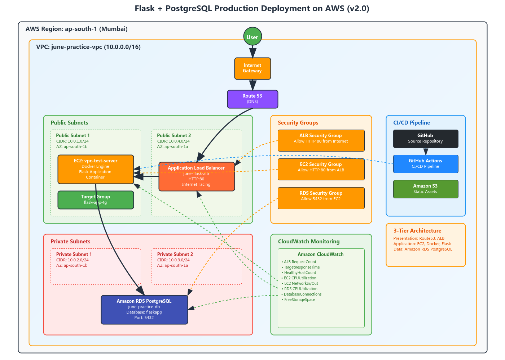
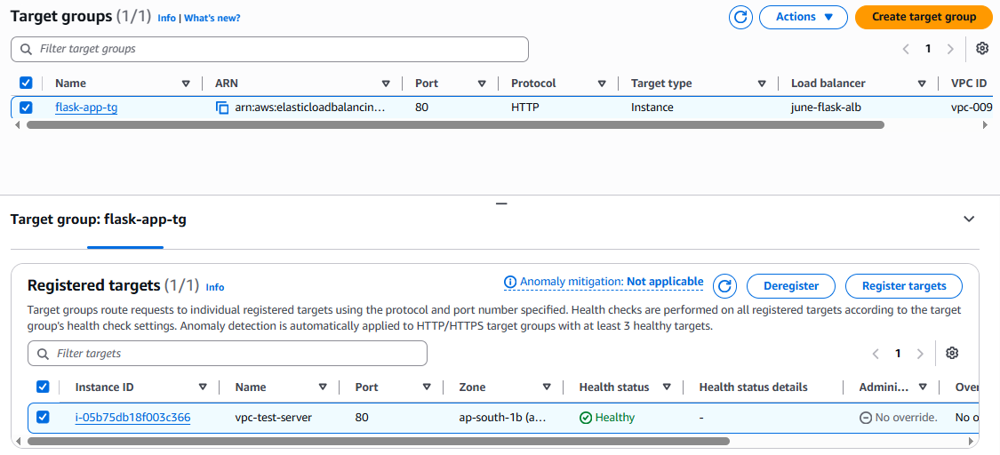
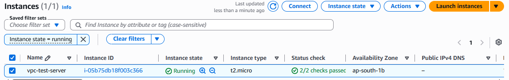
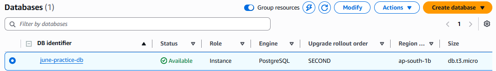
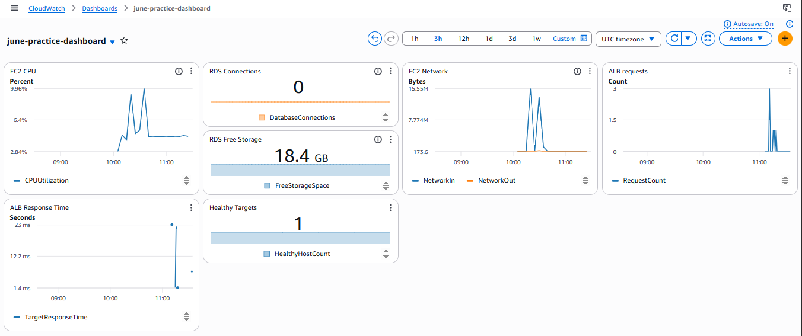
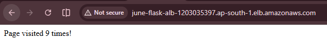

# Flask + PostgreSQL — Production Deployment on AWS


---

## Project Goal

Design and deploy a production-style three-tier web application on AWS using Docker, EC2, RDS PostgreSQL, Application Load Balancer, CloudWatch Monitoring, and custom VPC networking.

---

## Architecture Diagram



---

## What This Project Is

A containerized Flask web application deployed on AWS using production-grade infrastructure.

The application tracks page visits and stores the count in a PostgreSQL database.  
What started as a local Docker setup (v1.0) has been evolved into a real AWS production deployment (v2.0) — built as part of a hands-on cloud and DevOps learning journey.

---

## Architecture Overview

```
User
  │
  ▼
Application Load Balancer (ALB DNS)  ←── ALB Security Group (HTTP 80, HTTPS 443)
  │
  ▼
EC2 Instance (Public Subnet)  ←── EC2 Security Group (HTTP 80 from ALB only)
  │
  ▼
Docker Engine
  │
  ▼
Flask Application (Python)
  │
  ▼
Amazon RDS PostgreSQL (Private Subnet)  ←── RDS Security Group (5432 from EC2 only)
```

This follows the standard **3-Tier Architecture** pattern:

| Tier | Components |
|---|---|
| Presentation | Application Load Balancer |
| Application | EC2, Docker Engine, Flask App |
| Data | Amazon RDS PostgreSQL |

---

## AWS Services Used

| Service | Role |
|---|---|
| Amazon EC2 | Compute — runs the Docker container |
| Amazon RDS PostgreSQL | Managed database — isolated in private subnet |
| Application Load Balancer | Entry point — routes traffic to EC2 |
| Amazon VPC | Network boundary for all resources |
| Public Subnets | Host EC2 and ALB (internet-facing) |
| Private Subnets | Host RDS (no direct internet access) |
| Security Groups | Firewall rules per layer |
| Internet Gateway | Provides internet access to the VPC |
| Route Tables | Controls traffic flow between subnets |
| Amazon CloudWatch | Metrics and monitoring |
| IAM | Access control and permissions |

---

## VPC Design

```
VPC: 10.0.0.0/16
│
├── Public Subnets
│   ├── public-subnet-1   10.0.1.0/24
│   └── public-subnet-2   10.0.4.0/24
│
└── Private Subnets
    ├── private-subnet-1  10.0.2.0/24
    └── private-subnet-2  10.0.3.0/24
```

---

## Security Architecture

Access between layers is locked down using Security Groups:

```
Internet
   │
   ▼  (HTTP 80, HTTPS 443)
ALB Security Group
   │
   ▼  (HTTP 80 — from ALB only)
EC2 Security Group
   │
   ▼  (PostgreSQL 5432 — from EC2 only)
RDS Security Group
```

The database has no public IP and is unreachable from the internet directly.

---

## Monitoring

Amazon CloudWatch tracks the following metrics:

**Load Balancer**
- Request Count
- Response Time
- Healthy Host Count

**EC2**
- CPU Utilization
- Network In / Out

**RDS**
- CPU Utilization
- Database Connections
- Free Storage Space

---

## Production Features

- ALB Health Checks with `/health` endpoint
- RDS isolated in private subnets — no public IP
- Security Group layering (ALB → EC2 → RDS, no bypass)
- Environment variable based configuration — no hardcoded secrets
- CloudWatch metrics across all three tiers
- Persistent database storage via Amazon RDS
- Dockerized deployment with restart policy
- Multi-subnet VPC architecture across Availability Zones

---

## Application Endpoints

**Home**
```
GET /
```
Response:
```
Page visited X times!
```

**Health Check**
```
GET /health
```
Response:
```json
{
  "status": "healthy",
  "database": "connected"
}
```

Used by ALB health checks and operational monitoring.

---

## Tech Stack

| Layer | Technology |
|---|---|
| Backend | Python, Flask |
| Database | PostgreSQL (Amazon RDS) |
| Containerization | Docker, Docker Compose |
| Compute | Amazon EC2 |
| Load Balancing | Application Load Balancer |
| Networking | Amazon VPC |
| Monitoring | Amazon CloudWatch |

---

## Local Development (v1.0 Setup)

To run the application locally without AWS:

**Prerequisites**
- Docker
- Docker Compose

**Steps**

1. Create a `.env` file in the project root:

```
DB_NAME=myapp
DB_USER=user
DB_PASSWORD=password
DB_HOST=db
```

2. Start the containers:

```bash
docker compose up -d
```

3. Open in browser:

```
http://localhost:5000
```

---

## Docker Hub

Pull and run directly:

```bash
docker pull tanayjain29/flask-devops-app:v1.0
docker run -p 5000:5000 tanayjain29/flask-devops-app:v1.0
```

---

## Repository Structure

```
flask-docker-app/
│
├── app.py                      # Flask application
├── Dockerfile                  # Container image definition
├── docker-compose.yml          # Local multi-container setup
├── requirements.txt            # Python dependencies
├── .env                        # Environment variables (not committed)
├── .gitignore                  # Git ignored files
├── .dockerignore               # Docker ignored files
│
├── docs/
│   ├── architecture.png            # v1.0 local architecture diagram
│   ├── architecture-v2.png         # v2.0 AWS production architecture diagram
│   ├── alb-target-health.png       # ALB health check screenshot
│   ├── ec2-instance.png            # EC2 instance screenshot
│   ├── rds-instance.png            # RDS instance screenshot
│   ├── cloudwatch-dashboard.png    # CloudWatch dashboard screenshot
│   └── application-homepage.png    # Running application screenshot
│
└── README.md
```

---

## Deployment Workflow

```
Developer
      │
      ▼
Git Push
      │
      ▼
GitHub Repository
      │
      ▼
EC2 Instance
      │
      ▼
Docker Container
      │
      ▼
Flask Application
      │
      ▼
Amazon RDS PostgreSQL
```

---

## Version History

| Version | What Changed |
|---|---|
| v1.0 | Flask + PostgreSQL local Docker setup with Compose |
| v1.1 | Added health checks, restart policies, and monitoring |
| v2.0 | Full AWS production deployment — EC2, RDS, ALB, VPC, CloudWatch |

---

## Project Outcomes

Successfully designed, deployed, and documented a production-style three-tier web application architecture on AWS using modern cloud and DevOps practices.

- Containerized a Flask web application using Docker for consistent and portable deployments.
- Integrated Amazon RDS PostgreSQL as a managed and persistent database solution.
- Configured an Application Load Balancer to distribute traffic and perform health checks.
- Designed and implemented a custom VPC with public and private subnets across multiple Availability Zones.
- Applied Security Group based network isolation to enforce secure communication between application layers.
- Implemented CloudWatch monitoring and dashboards for infrastructure visibility and performance tracking.
- Added application health check endpoints to improve reliability and operational monitoring.
- Followed a production-style three-tier architecture pattern separating presentation, application, and data layers.
- Managed application configuration using environment variables instead of hardcoded credentials.
- Created detailed architecture diagrams and deployment documentation for maintainability and knowledge sharing.

---

## What I Learned

Through building v1.0 → v2.0, I gained practical experience with:

**Docker & Containerization**
- Building Docker images
- Multi-container architecture with Compose
- Volumes, networking, restart policies, and `.dockerignore`

**AWS & Cloud Infrastructure**
- EC2 provisioning and Linux administration
- Amazon RDS setup and private subnet isolation
- Application Load Balancer configuration and health checks
- VPC design with public/private subnets
- Security group rules per layer
- IAM roles and least-privilege access
- CloudWatch metrics and dashboards

**DevOps Practices**
- Environment variable management
- Infrastructure troubleshooting
- 3-tier architecture patterns
- Network security fundamentals

---

## Screenshots

### AWS Architecture

This diagram illustrates the complete AWS three-tier architecture used in this project, including the Application Load Balancer, EC2 instance running the Dockerized Flask application, and Amazon RDS PostgreSQL deployed in private subnets.


---

### Application Load Balancer Health Check

The Application Load Balancer performs health checks against the Flask application's `/health` endpoint to ensure traffic is routed only to healthy targets.



---

### EC2 Instance

Amazon EC2 hosts the Docker container running the Flask application. The instance is deployed within a public subnet and receives traffic through the Application Load Balancer.



---

### Amazon RDS PostgreSQL

Amazon RDS PostgreSQL serves as the application's managed database layer. The database is deployed in private subnets and is accessible only from the application layer.



---

### CloudWatch Dashboard

Amazon CloudWatch provides monitoring and visibility into the application's infrastructure, including EC2, RDS, and Load Balancer metrics.



---

### Running Application

The Flask application is accessible through the Application Load Balancer DNS endpoint and stores page visit counts in Amazon RDS PostgreSQL.



---

## Planned Improvements

- Custom domain with Route 53 + HTTPS via AWS Certificate Manager (ACM)
- Static assets served from Amazon S3
- Auto Scaling Group for EC2
- CI/CD pipeline using GitHub Actions
- Infrastructure as Code using Terraform
- Container orchestration with ECS or EKS
- Multi-AZ application layer
- Centralized logging with CloudWatch Logs

---

## Author

**Tanay Jain**  
BCA Student — Cloud & DevOps Learner

Built as part of a self-driven cloud and DevOps learning path.

---

*This project is created for educational and learning purposes.*
