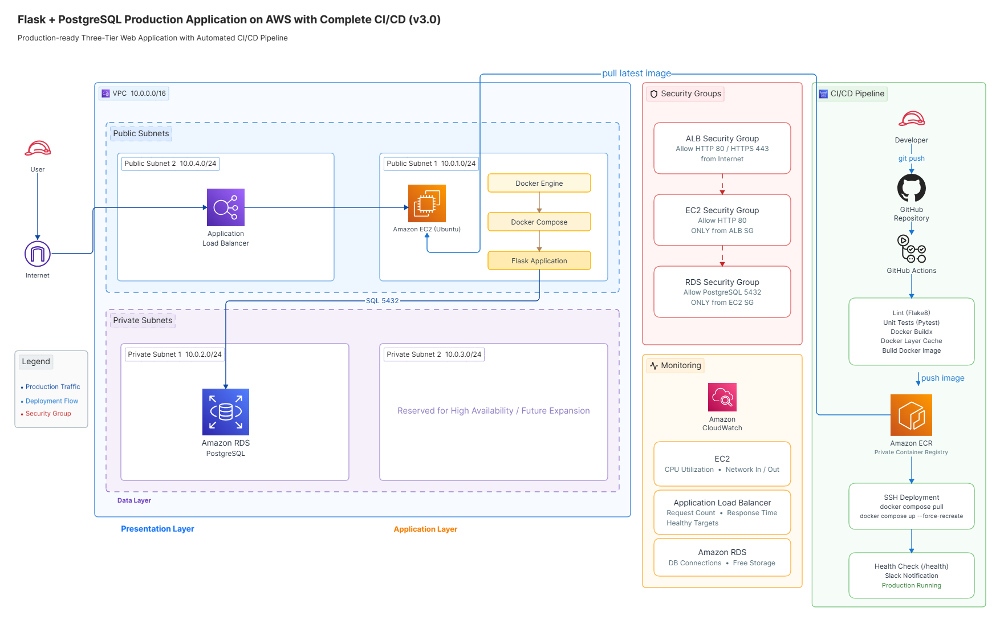
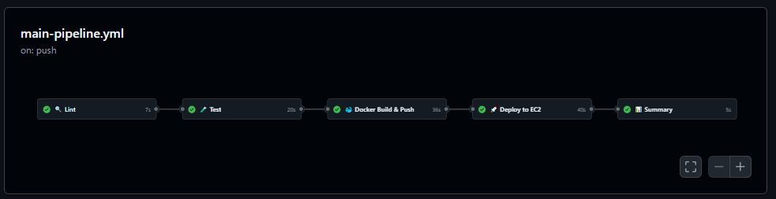
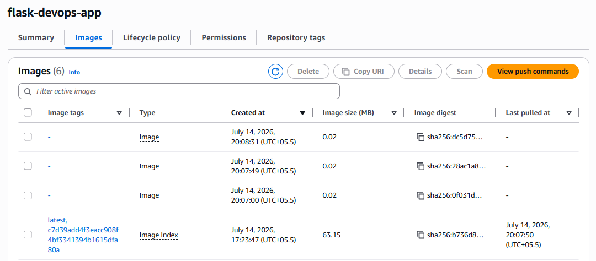

# Flask + PostgreSQL - Production-style CI/CD Pipeline on AWS

[](https://github.com/tanayjdev/flask-docker-app/actions/workflows/main-pipeline.yml)
[](https://hub.docker.com/r/tanayjain29/flask-devops-app)


---

## Key Highlights

- Production-style Flask application
- Dockerized deployment
- GitHub Actions CI/CD Pipeline
- Amazon Elastic Container Registry (ECR)
- Automated deployment to Amazon EC2
- Application Load Balancer (ALB)
- CloudWatch monitoring
- Matrix builds for multiple Python versions
- Reusable GitHub Actions workflows
- Composite GitHub Actions
- Docker layer & pip dependency caching
- Slack deployment notifications
- Project evolution from local Docker → AWS Infrastructure → Full CI/CD
---

## Project Goal

Build, containerize, and deploy a production-style Flask web application on AWS while implementing an end-to-end CI/CD pipeline using GitHub Actions and modern DevOps practices.

The project demonstrates modern DevOps practices including automated code quality checks, testing, container image builds, continuous deployment, AWS infrastructure, monitoring, deployment automation, and infrastructure best practices.

---

## Current Architecture (v3.0)



---

## What This Project Is

A production-style Flask web application deployed on AWS using Docker and automated through a complete CI/CD pipeline.

The application tracks page visits using PostgreSQL while demonstrating how modern cloud infrastructure and deployment automation work together.

The project evolved through multiple versions:

- **v1.0** — Local Dockerized Flask + PostgreSQL application
- **v2.0** — Production AWS infrastructure using EC2, ALB, RDS, VPC and CloudWatch
- **v3.0** — Complete CI/CD pipeline with GitHub Actions, AWS ECR, automated deployments, caching, reusable workflows and deployment notifications

---

## Architecture Overview

```
Developer
     │
     ▼
GitHub
     │
     ▼
GitHub Actions
     │
     ▼
Amazon ECR
     │
     ▼
Amazon EC2
     │
     ▼
Docker Engine
     │
     ▼
Flask Application
```
> This diagram represents the current v3.0 automated deployment architecture.

| Tier | Components |
|---|---|
| Presentation | Application Load Balancer |
| Application | EC2, Docker Engine, Flask App |
| Data | Amazon RDS PostgreSQL |

---

## AWS Services Used

| Service | Role |
|---|---|
| Amazon EC2 | Compute — runs the Docker container |
| Amazon RDS PostgreSQL | Managed database — isolated in private subnet |
| Application Load Balancer | Entry point — routes traffic to EC2 |
| Amazon VPC | Network boundary for all resources |
| Public Subnets | Host EC2 and ALB (internet-facing) |
| Private Subnets | Host RDS (no direct internet access) |
| Security Groups | Firewall rules per layer |
| Internet Gateway | Provides internet access to the VPC |
| Route Tables | Controls traffic flow between subnets |
| Amazon CloudWatch | Metrics and monitoring |
| IAM | Access control and permissions |
| GitHub Actions | CI/CD automation platform |
| Amazon ECR | Private Docker image registry |

---

## VPC Design

```
VPC: 10.0.0.0/16
│
├── Public Subnets
│   ├── public-subnet-1   10.0.1.0/24
│   └── public-subnet-2   10.0.4.0/24
│
└── Private Subnets
    ├── private-subnet-1  10.0.2.0/24
    └── private-subnet-2  10.0.3.0/24
```

---

## Security Architecture

Access between layers is locked down using Security Groups:

```
Internet
   │
   ▼  (HTTP 80, HTTPS 443)
ALB Security Group
   │
   ▼  (HTTP 80 — from ALB only)
EC2 Security Group
   │
   ▼  (PostgreSQL 5432 — from EC2 only)
RDS Security Group
```

The database has no public IP and is unreachable from the internet directly.

---

## Monitoring

Amazon CloudWatch tracks the following metrics:

**Load Balancer**
- Request Count
- Response Time
- Healthy Host Count

**EC2**
- CPU Utilization
- Network In / Out

**RDS**
- CPU Utilization
- Database Connections
- Free Storage Space

---

## Production Features

### Infrastructure (v2.0)

- Three-tier AWS architecture (Application Load Balancer → EC2 → Amazon RDS PostgreSQL)
- Application Load Balancer health checks using the `/health` endpoint
- Amazon RDS PostgreSQL deployed in private subnets (no public internet access)
- Security Group based network isolation (ALB → EC2 → RDS)
- Multi-subnet Amazon VPC architecture across multiple Availability Zones
- Environment variable based configuration (no hardcoded credentials)
- Persistent PostgreSQL storage using Amazon RDS
- Dockerized application with automatic container restart policies
- Infrastructure monitoring using Amazon CloudWatch

### CI/CD Automation (v3.0)

- End-to-end CI/CD pipeline using GitHub Actions
- Automated code quality checks with Flake8
- Automated unit testing using Pytest with coverage reporting
- Docker image builds using Docker Buildx
- Docker layer caching for faster image builds
- pip dependency caching for improved pipeline performance
- Automated image publishing to Amazon Elastic Container Registry (ECR)
- Automated deployment to Amazon EC2 after successful builds
- Post-deployment health check verification
- Matrix testing across multiple Python versions
- Reusable GitHub Actions workflows
- Composite GitHub Actions for reusable automation
- GitHub Actions workflow summaries
- Slack deployment notifications for successful and failed deployments

---

## Application Endpoints

**Home**
```
GET /
```
Response:
```
Page visited X times!
```

**Health Check**
```
GET /health
```
Response:
```json
{
  "status": "healthy",
  "database": "connected"
}
```

Used by ALB health checks and operational monitoring.

---

## Tech Stack

| Layer | Technology |
|---|---|
| Backend | Python, Flask |
| Database | PostgreSQL (Amazon RDS) |
| Containerization | Docker, Docker Compose |
| Compute | Amazon EC2 |
| Load Balancing | Application Load Balancer |
| Networking | Amazon VPC |
| Monitoring | Amazon CloudWatch |
| CI/CD | GitHub Actions |
| Image Registry | Amazon ECR |
| Testing | Pytest |
| Code Quality | Flake8 |

---

## Local Development (v1.0)

To run the application locally without AWS:

**Prerequisites**
- Docker
- Docker Compose

**Steps**

1. Create a `.env` file in the project root:

```
DB_NAME=myapp
DB_USER=user
DB_PASSWORD=password
DB_HOST=db
```

2. Start the containers:

```bash
docker compose up -d
```

3. Open in browser:

```
http://localhost:5000
```

---

## Container Images

Container image distribution evolved across project versions.

- **v1.0 – v2.0:** Docker images were published to Docker Hub for learning and local deployments.
- **v3.0:** The production CI/CD pipeline publishes Docker images to **Amazon Elastic Container Registry (ECR)**, which is used by the EC2 instance during automated deployments.

Using Amazon ECR provides:

- Private image registry
- IAM-based authentication
- Faster image pulls within AWS
- Better integration with GitHub Actions and Amazon EC2

---

## Repository Structure

```text
flask-docker-app/
│
├── .github/
│   ├── workflows/
│   │   ├── main-pipeline.yml
│   │   ├── matrix-test.yml
│   │   ├── reusable-test.yml
│   │   ├── caller.yml
│   │   └── deploy.yml
│   │
│   └── actions/
│       └── setup-python-env/
│           └── action.yml
│
├── docs/
│   ├── architecture-v3.png
│   ├── main-pipeline-success.png
│   ├── ecr-repository.png
│   ├── alb-target-health.png
│   ├── cloudwatch-dashboard.png
│   └── application-homepage.png
│
├── app.py
├── Dockerfile
├── docker-compose.yml
├── requirements.txt
├── test_app.py
├── README.md
├── .dockerignore
├── .gitignore
└── .env.example
```
---

## CI/CD Pipeline

```text
Developer
     │
     ▼
Git Push
     │
     ▼
GitHub Repository
     │
     ▼
GitHub Actions
     │
     ├── Lint
     ├── Test
     ├── Docker Build
     ├── Push to Amazon ECR
     ├── Deploy to EC2
     ├── Health Check
     └── Slack Notification
     │
     ▼
Production
```

---

## CI/CD Pipeline Overview

Every push to the `main` branch automatically triggers the complete CI/CD pipeline.

The workflow performs the following stages:

1. Source code is pushed to GitHub.
2. GitHub Actions automatically starts the workflow.
3. Flake8 performs code quality checks.
4. Pytest executes unit tests.
5. Docker Buildx builds the application image.
6. The image is pushed to AWS ECR.
7. GitHub Actions securely connects to the EC2 instance over SSH.
8. EC2 pulls the latest image from AWS ECR.
9. Docker Compose recreates the application containers.
10. The application health endpoint is verified.
11. Deployment summaries and notifications are generated.

---

## Version History

| Version | Highlights |
|---------|------------|
| v1.0 | Flask + PostgreSQL running locally using Docker Compose |
| v1.1 | Health endpoint, restart policies and monitoring improvements |
| v2.0 | AWS deployment with EC2, ALB, RDS, VPC and CloudWatch |
| v3.0 | Complete CI/CD pipeline with GitHub Actions, Amazon ECR, automated deployment, caching, reusable workflows, matrix builds and Slack notifications |

---

## Project Outcomes

Successfully designed, deployed, and documented a production-style three-tier web application architecture on AWS using modern cloud and DevOps practices.

- Containerized a Flask web application using Docker for consistent and portable deployments.
- Integrated Amazon RDS PostgreSQL as a managed and persistent database solution.
- Configured an Application Load Balancer to distribute traffic and perform health checks.
- Designed and implemented a custom VPC with public and private subnets across multiple Availability Zones.
- Applied Security Group based network isolation to enforce secure communication between application layers.
- Implemented CloudWatch monitoring and dashboards for infrastructure visibility and performance tracking.
- Added application health check endpoints to improve reliability and operational monitoring.
- Followed a production-style three-tier architecture pattern separating presentation, application, and data layers.
- Managed application configuration using environment variables instead of hardcoded credentials.
- Created detailed architecture diagrams and deployment documentation for maintainability and knowledge sharing.
- Built a complete CI/CD pipeline using GitHub Actions.
- Automated Docker image builds and publishing to Amazon ECR.
- Automated deployments to Amazon EC2 after successful builds.
- Implemented reusable workflows, matrix builds and composite GitHub Actions.
- Added deployment notifications and workflow summaries.
- Optimized build performance using dependency and Docker layer caching.

---

## What I Learned

Through building **v1.0 → v3.0**, I gained practical experience with:

**Docker & Containerization**
- Building Docker images
- Multi-container architecture with Compose
- Volumes, networking, restart policies, and `.dockerignore`

**AWS & Cloud Infrastructure**
- EC2 provisioning and Linux administration
- Amazon RDS setup and private subnet isolation
- Application Load Balancer configuration and health checks
- VPC design with public/private subnets
- Security group rules per layer
- IAM roles and least-privilege access
- CloudWatch metrics and dashboards

**DevOps Practices**
- Environment variable management
- Infrastructure troubleshooting
- 3-tier architecture patterns
- Network security fundamentals

**CI/CD & Automation**

- GitHub Actions workflows
- Workflow triggers
- Jobs and runners
- Secrets management
- Matrix builds
- Reusable workflows
- Composite Actions
- Docker Buildx
- Amazon ECR
- Deployment automation
- Build caching
- Pipeline debugging
- Deployment notifications
---

## Screenshots

### AWS Architecture

This diagram illustrates the complete AWS three-tier architecture used in this project, including the Application Load Balancer, EC2 instance running the Dockerized Flask application, and Amazon RDS PostgreSQL deployed in private subnets.


---

### GitHub Actions CI/CD Pipeline

The GitHub Actions workflow automatically validates, builds, and deploys the application whenever changes are pushed to the main branch. The pipeline performs code quality checks, executes unit tests, builds the Docker image, pushes it to Amazon ECR, deploys the latest version to Amazon EC2, and verifies the deployment using application health checks.



---

### Amazon Elastic Container Registry (ECR)

Amazon Elastic Container Registry (ECR) stores versioned Docker images used by the deployment pipeline. Each successful build automatically publishes a new image to the private registry, allowing Amazon EC2 to securely pull and deploy the latest application version during the CI/CD process.



---

### Application Load Balancer Health Check

The Application Load Balancer performs health checks against the Flask application's `/health` endpoint to ensure traffic is routed only to healthy targets.


---

### CloudWatch Dashboard

Amazon CloudWatch provides monitoring and visibility into the application's infrastructure, including EC2, RDS, and Load Balancer metrics.


---

### Running Application

The Flask application is accessible through the Application Load Balancer DNS endpoint and stores page visit counts in Amazon RDS PostgreSQL.


---

## Planned Improvements

- Kubernetes deployment using Amazon EKS
- Infrastructure as Code using Terraform
- Auto Scaling Group for EC2
- Custom domain with Route 53 and HTTPS (AWS Certificate Manager)
- Static assets hosted on Amazon S3
- Multi-AZ application deployment
- Centralized logging with CloudWatch Logs
  
---

## Author

**Tanay Jain**  
BCA Student — Cloud & DevOps Learner

Built as part of a structured hands-on Cloud & DevOps learning roadmap focused on production infrastructure, CI/CD automation and AWS deployment.

---

*This project is created for educational and learning purposes.*
